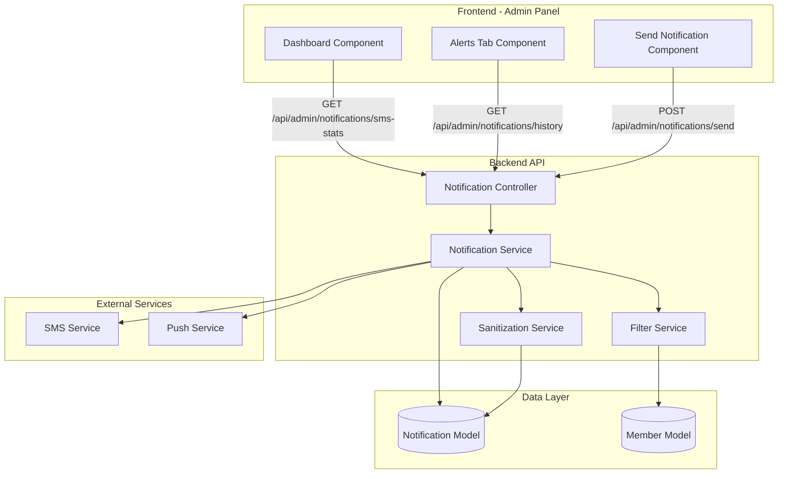

# Design Document: Admin Notification System

## Overview

The Admin Notification System extends the admin panel with comprehensive notification management capabilities. The system enables administrators to send SMS and push notifications to filtered member groups, track notification history with delivery status, and monitor SMS usage metrics. The architecture follows a layered approach with clear separation between the frontend UI, backend API, notification services, and data persistence.

Key design principles:

- **Security-first**: Sensitive content is automatically detected and sanitized before storage
- **Audit trail**: Complete history of all notifications with delivery tracking
- **Flexible filtering**: Multiple filter criteria for precise recipient targeting
- **Scalability**: Efficient database queries and rate limiting for bulk operations
- **User experience**: Real-time previews, character counts, and confirmation dialogs

## Architecture

The system consists of four main layers:

### 1. Frontend Layer (Admin Panel UI)

- **Dashboard Component**: Displays SMS metrics (today + all-time counts)
- **Alerts Tab Component**: Shows paginated notification history with filters
- **Send Notification Component**: Provides notification composition interface with recipient filtering
- **API Client**: Handles HTTP requests to backend endpoints

### 2. Backend API Layer

- **Notification Controller**: Exposes REST endpoints for notification operations
- **Notification Service**: Implements business logic for sending and tracking notifications
- **Filter Service**: Processes recipient filter criteria and builds database queries
- **Sanitization Service**: Detects and protects sensitive content patterns

### 3. External Services Layer

- **SMS Service**: Third-party SMS gateway integration (e.g., Twilio, AWS SNS)
- **Push Notification Service**: Push notification provider integration (e.g., Firebase Cloud Messaging)

### 4. Data Layer

- **Notification Model**: Prisma schema entity for notification records
- **Member Model**: Existing member data used for recipient filtering
- **Database**: PostgreSQL database for persistent storage

### Architecture Diagram



## Components and Interfaces

### Frontend Components

#### 1. Dashboard SMS Metrics Component

**Purpose**: Display SMS usage statistics on the admin dashboard

**Interface**:

```typescript
interface SMSMetrics {
  todayCount: number;
  allTimeCount: number;
}

// API call
async function fetchSMSMetrics(): Promise<SMSMetrics>;
```

**Behavior**:

- Fetches SMS statistics on component mount
- Displays both metrics prominently with labels
- Updates in real-time when new notifications are sent

#### 2. Notification History Component (Alerts Tab)

**Purpose**: Display paginated list of all sent notifications with filtering

**Interface**:

```typescript
interface NotificationRecord {
  id: string;
  type: "SMS" | "PUSH";
  recipientCount: number;
  message: string; // Sanitized content
  status: "pending" | "sent" | "delivered" | "failed";
  deliveryStats: {
    successCount: number;
    failureCount: number;
  };
  sentAt: Date;
  sentBy: string; // Admin username
}

interface NotificationHistoryParams {
  page: number;
  pageSize: number;
  type?: "SMS" | "PUSH";
  status?: string;
  dateFrom?: Date;
  dateTo?: Date;
}

interface NotificationHistoryResponse {
  notifications: NotificationRecord[];
  total: number;
  page: number;
  pageSize: number;
}

// API call
async function fetchNotificationHistory(
  params: NotificationHistoryParams,
): Promise<NotificationHistoryResponse>;
```

**Behavior**:

- Displays table with columns: Type, Recipients, Message, Status, Delivery Rate, Sent At, Sent By
- Shows "[PROTECTED]" for sanitized messages
- Provides filter controls for type, status, and date range
- Implements pagination with page size selector
- Calculates and displays delivery success rate percentage

#### 3. Send Notification Component

**Purpose**: Compose and send notifications with recipient filtering

**Interface**:

```typescript
interface RecipientFilters {
  packageTypes?: ("Bronze" | "Silver" | "Gold")[];
  dateJoinedFrom?: Date;
  dateJoinedTo?: Date;
  balanceMin?: number;
  balanceMax?: number;
  subscriptionStatus?: "active" | "inactive";
  singlePhoneNumber?: string;
  csvPhoneNumbers?: string[]; // Parsed from uploaded CSV
}

interface SendNotificationRequest {
  type: "SMS" | "PUSH";
  filters: RecipientFilters;
  message: string;
}

interface RecipientPreview {
  count: number;
  sampleRecipients?: string[]; // First few phone numbers for preview
}

// API calls
async function previewRecipients(
  filters: RecipientFilters,
): Promise<RecipientPreview>;

async function sendNotification(
  request: SendNotificationRequest,
): Promise<{ success: boolean; notificationId: string }>;
```

**Behavior**:

- Provides radio buttons for notification type selection (SMS/Push)
- Displays filter controls for each filter type
- Shows recipient count preview that updates as filters change
- Provides text area for message composition with character counter
- Handles CSV file upload, parsing, and validation
- Shows confirmation dialog before sending with recipient count and message preview
- Displays success/error feedback after sending

### Backend Components

#### 1. Notification Controller

**Purpose**: Expose REST API endpoints for notification operations

**Endpoints**:

```typescript
// GET /api/admin/notifications/sms-stats
// Returns SMS usage statistics
interface SMSStatsResponse {
  todayCount: number;
  allTimeCount: number;
}

// GET /api/admin/notifications/history
// Returns paginated notification history
// Query params: page, pageSize, type, status, dateFrom, dateTo
interface HistoryResponse {
  notifications: NotificationRecord[];
  total: number;
  page: number;
  pageSize: number;
}

// POST /api/admin/notifications/preview
// Returns recipient count for given filters
interface PreviewRequest {
  filters: RecipientFilters;
}
interface PreviewResponse {
  count: number;
}

// POST /api/admin/notifications/send
// Sends notification to filtered recipients
interface SendRequest {
  type: "SMS" | "PUSH";
  filters: RecipientFilters;
  message: string;
}
interface SendResponse {
  success: boolean;
  notificationId: string;
  recipientCount: number;
}
```

**Security**:

- All endpoints require admin authentication (AdminAuthGuard)
- Send endpoint has rate limiting (max 10 bulk sends per hour per admin)
- Input validation on all request bodies

#### 2. Notification Service

**Purpose**: Implement core business logic for notification operations

**Interface**:

```typescript
class NotificationService {
  // Calculate SMS statistics
  async getSMSStats(): Promise<SMSStatsResponse>;

  // Retrieve notification history with pagination
  async getNotificationHistory(
    params: NotificationHistoryParams,
  ): Promise<HistoryResponse>;

  // Preview recipient count for filters
  async previewRecipients(filters: RecipientFilters): Promise<PreviewResponse>;

  // Send notification to filtered recipients
  async sendNotification(
    request: SendRequest,
    adminId: string,
  ): Promise<SendResponse>;

  // Update delivery status for a notification
  async updateDeliveryStatus(
    notificationId: string,
    recipientPhone: string,
    status: "delivered" | "failed",
  ): Promise<void>;
}
```

**Behavior**:

- `getSMSStats`: Queries database for SMS count today (using date filter) and all-time count
- `getNotificationHistory`: Builds query with filters, applies pagination, returns results
- `previewRecipients`: Uses FilterService to count matching members
- `sendNotification`:
  1. Uses FilterService to get recipient list
  2. Uses SanitizationService to sanitize message for storage
  3. Creates Notification record in database
  4. Calls SMS_Service or Push_Service to send to each recipient
  5. Updates delivery stats as responses come back
  6. Returns notification ID and recipient count
- `updateDeliveryStatus`: Updates delivery stats in Notification record

#### 3. Filter Service

**Purpose**: Process recipient filters and build database queries

**Interface**:

```typescript
class FilterService {
  // Get list of member phone numbers matching filters
  async getFilteredRecipients(filters: RecipientFilters): Promise<string[]>;

  // Count members matching filters
  async countFilteredRecipients(filters: RecipientFilters): Promise<number>;

  // Validate and parse CSV file
  async parseCSVPhoneNumbers(
    fileBuffer: Buffer,
  ): Promise<{ valid: string[]; errors: string[] }>;
}
```

**Behavior**:

- Builds Prisma query combining all active filters with AND logic
- For package types: `packageType: { in: filters.packageTypes }`
- For date joined: `createdAt: { gte: dateFrom, lte: dateTo }`
- For balance: `balanceAccrued: { gte: balanceMin, lte: balanceMax }`
- For subscription status: `subscription: { status: filters.subscriptionStatus }`
- For single phone: returns array with single validated phone number
- For CSV: parses file, validates each phone number, deduplicates, returns valid list
- Handles empty result sets gracefully

#### 4. Sanitization Service

**Purpose**: Detect and protect sensitive content in notification messages

**Interface**:

```typescript
class SanitizationService {
  // Sanitize message content for storage
  sanitizeMessage(message: string): string;

  // Check if message contains sensitive patterns
  containsSensitiveContent(message: string): boolean;
}
```

**Behavior**:

- Defines sensitive patterns as regex:
  - `/password/i`
  - `/otp|one-time password/i`
  - `/\bpin\b|pin code/i`
  - `/verification code|code.*\d{4,}/i`
- `containsSensitiveContent`: Returns true if any pattern matches
- `sanitizeMessage`: If sensitive content detected, returns "[PROTECTED]", otherwise returns original message
- Case-insensitive matching for all patterns

## Data Models

### Notification Model (Prisma Schema)

```prisma
model Notification {
  id                String   @id @default(uuid())
  type              NotificationType
  recipientCount    Int
  message           String   @db.Text // Sanitized content
  originalMessage   String?  @db.Text // Optional: store hash for audit
  status            NotificationStatus @default(PENDING)
  successCount      Int      @default(0)
  failureCount      Int      @default(0)
  sentAt            DateTime @default(now())
  sentBy            String   // Admin user ID
  sentByAdmin       Admin    @relation(fields: [sentBy], references: [id])

  // Filter criteria used (for audit trail)
  filterCriteria    Json?

  createdAt         DateTime @default(now())
  updatedAt         DateTime @updatedAt

  @@index([type, sentAt])
  @@index([sentBy])
  @@index([status])
}

enum NotificationType {
  SMS
  PUSH
}

enum NotificationStatus {
  PENDING
  SENT
  DELIVERED
  FAILED
  PARTIAL // Some delivered, some failed
}
```

**Design Decisions**:

- `message` field stores sanitized content (with "[PROTECTED]" if sensitive)
- `originalMessage` could store a hash for verification without storing actual sensitive data
- `filterCriteria` stores the filters used as JSON for audit purposes
- Indexes on `type`, `sentAt`, `sentBy`, and `status` for efficient querying
- `successCount` and `failureCount` track delivery statistics
- `recipientCount` stores total recipients for quick reference

### Extended Admin Model

```prisma
model Admin {
  id            String         @id @default(uuid())
  // ... existing fields ...
  notifications Notification[]
}
```

## Correctness Properties

_A property is a characteristic or behavior that should hold true across all valid executions of a system—essentially, a formal statement about what the system should do. Properties serve as the bridge between human-readable specifications and machine-verifiable correctness guarantees._

### Property Reflection

After analyzing all acceptance criteria, I've identified the following redundancies and consolidations:

**Redundancies to eliminate:**

- 6.7 is redundant with 6.6 (both test that sent messages are unmodified while stored messages are sanitized)
- 7.6 is redundant with 7.5 (both test that admin ID is stored in audit trail)
- 1.1 and 1.2 can be combined into a single property about SMS count accuracy
- 4.1-4.6 can be combined into a single property about required fields in the data model
- 6.1-6.4 can be combined into a single property about sensitive pattern detection
- 9.1-9.3 can be combined into a single property about status transitions

**Properties to combine:**

- SMS metrics (1.1, 1.2, 1.4) → Single property about metric calculation accuracy
- Notification model fields (4.1-4.6) → Single property about data model completeness
- Sensitive pattern detection (6.1-6.4) → Single property about pattern matching
- Status transitions (9.1-9.3) → Single property about delivery status updates
- Delivery counting (9.4, 9.5) → Single property about delivery statistics accuracy

### Correctness Properties

Property 1: SMS Metrics Calculation Accuracy
_For any_ set of notifications in the database, the SMS statistics endpoint should return a today count equal to the number of SMS notifications sent today, and an all-time count equal to the total number of SMS notifications ever sent.
**Validates: Requirements 1.1, 1.2, 1.4, 5.6**

Property 2: Notification History Pagination
_For any_ page number and page size, the notification history endpoint should return exactly pageSize records (or fewer if on the last page), and the total count should equal the actual number of notifications in the database matching the filters.
**Validates: Requirements 2.1, 5.5**

Property 3: Required Fields Display
_For any_ notification record, the displayed output should contain the notification type, recipient count, timestamp, and delivery status.
**Validates: Requirements 2.2, 2.6**

Property 4: Sensitive Content Sanitization in Display
_For any_ notification message containing sensitive patterns (password, otp, pin, verification code), the displayed content should show "[PROTECTED]" instead of the original message.
**Validates: Requirements 2.3, 6.5**

Property 5: Filter Query Correctness
_For any_ combination of recipient filters (package type, date joined, balance, subscription status), the query should return only members that match ALL specified filter criteria (AND logic).
**Validates: Requirements 2.5, 8.1, 8.2, 8.3, 8.4, 8.7**

Property 6: Recipient Preview Accuracy
_For any_ set of recipient filters, the preview count should equal the actual number of members that would be returned by executing the filter query.
**Validates: Requirements 3.8**

Property 7: Character Count Accuracy
_For any_ message text, the displayed character count should equal the actual length of the message string.
**Validates: Requirements 3.9**

Property 8: Notification Delivery to All Recipients
_For any_ valid send notification request, all members matching the filter criteria should receive the notification.
**Validates: Requirements 3.11**

Property 9: Notification Model Completeness
_For any_ notification record stored in the database, it should contain all required fields: id, type, recipientCount, message (sanitized), status, successCount, failureCount, sentAt, and sentBy.
**Validates: Requirements 4.1, 4.2, 4.3, 4.4, 4.5, 4.6**

Property 10: Sanitization Before Storage
_For any_ notification message containing sensitive patterns, the stored message in the database should be "[PROTECTED]", while the message sent to recipients should be the original unmodified text.
**Validates: Requirements 4.7, 6.5, 6.6**

Property 11: Immediate Persistence
_For any_ notification sent, querying the database immediately after the send operation should return the notification record.
**Validates: Requirements 4.8**

Property 12: Filter Parameter Validation
_For any_ invalid filter parameters (negative balance, invalid date range, malformed phone number), the API should reject the request with a validation error before processing.
**Validates: Requirements 5.4, 8.5**

Property 13: Sensitive Pattern Detection
_For any_ message containing the patterns "password", "otp", "one-time password", "pin", "PIN code", "verification code", or "code" followed by 4+ digits (case-insensitive), the sanitization service should detect it as sensitive content.
**Validates: Requirements 6.1, 6.2, 6.3, 6.4**

Property 14: Authentication Requirement
_For any_ notification API endpoint, requests without valid admin authentication should be rejected with a 401 Unauthorized status.
**Validates: Requirements 7.1, 7.2**

Property 15: Rate Limiting Enforcement
_For any_ admin user, attempting to send more than 10 bulk notifications within one hour should result in subsequent requests being rejected with a 429 Too Many Requests status.
**Validates: Requirements 7.3**

Property 16: Audit Trail Completeness
_For any_ notification sent, the stored record should include the administrator ID who initiated the send operation.
**Validates: Requirements 7.5, 7.6**

Property 17: Phone Number Validation
_For any_ phone number input (single or from CSV), invalid phone number formats should be rejected with a descriptive error message.
**Validates: Requirements 8.5, 10.4**

Property 18: CSV Parsing and Deduplication
_For any_ CSV file uploaded, the system should extract phone numbers from the first column, skip header rows, deduplicate the list, and return only valid unique phone numbers.
**Validates: Requirements 8.6, 10.2, 10.3, 10.5**

Property 19: Delivery Status Transitions
_For any_ notification, the status should transition from "pending" to "sent" when delivery begins, then to "delivered" when all recipients confirm delivery, "failed" when all deliveries fail, or "partial" when some succeed and some fail.
**Validates: Requirements 9.1, 9.2, 9.3**

Property 20: Delivery Statistics Accuracy
_For any_ notification, the sum of successCount and failureCount should equal the recipientCount, and the displayed success rate percentage should equal (successCount / recipientCount) \* 100.
**Validates: Requirements 9.4, 9.5, 9.6, 9.7**

Property 21: CSV File Format Validation
_For any_ uploaded file, if the file is not in CSV format or is empty, the system should reject it with a descriptive error message.
**Validates: Requirements 10.1, 10.7**

Property 22: Valid Phone Count Display
_For any_ CSV file successfully parsed, the displayed count of valid phone numbers should equal the actual number of valid, deduplicated phone numbers extracted from the file.
**Validates: Requirements 10.6**

## Error Handling

### Input Validation Errors

**Invalid Filter Parameters**:

- Negative balance values → Return 400 Bad Request with message "Balance values must be non-negative"
- Invalid date range (end before start) → Return 400 Bad Request with message "End date must be after start date"
- Malformed phone number → Return 400 Bad Request with message "Invalid phone number format: {number}"

**CSV Upload Errors**:

- Non-CSV file → Return 400 Bad Request with message "File must be in CSV format"
- Empty CSV file → Return 400 Bad Request with message "CSV file is empty"
- All phone numbers invalid → Return 400 Bad Request with message "No valid phone numbers found in CSV"
- File too large (>5MB) → Return 413 Payload Too Large with message "CSV file exceeds maximum size of 5MB"

**Message Validation Errors**:

- Empty message → Return 400 Bad Request with message "Message cannot be empty"
- Message too long (>1600 chars for SMS) → Return 400 Bad Request with message "SMS message exceeds maximum length of 1600 characters"

### Authentication and Authorization Errors

**Unauthenticated Requests**:

- Missing auth token → Return 401 Unauthorized with message "Authentication required"
- Invalid auth token → Return 401 Unauthorized with message "Invalid authentication token"
- Expired auth token → Return 401 Unauthorized with message "Authentication token expired"

**Rate Limiting Errors**:

- Rate limit exceeded → Return 429 Too Many Requests with message "Rate limit exceeded. Maximum 10 bulk sends per hour. Try again in {minutes} minutes."
- Include `Retry-After` header with seconds until rate limit resets

### External Service Errors

**SMS Service Failures**:

- SMS gateway timeout → Log error, mark notification as "failed", return 500 with message "SMS service temporarily unavailable"
- SMS gateway rate limit → Queue notification for retry, return 202 Accepted with message "Notification queued for delivery"
- Invalid recipient number → Mark individual delivery as failed, continue with other recipients

**Push Service Failures**:

- Push service unavailable → Log error, mark notification as "failed", return 500 with message "Push notification service temporarily unavailable"
- Invalid device token → Mark individual delivery as failed, continue with other recipients

### Database Errors

**Query Failures**:

- Database connection error → Return 500 Internal Server Error with message "Database temporarily unavailable"
- Query timeout → Return 504 Gateway Timeout with message "Request timed out. Please try again."

**Data Integrity Errors**:

- Duplicate notification ID → Retry with new UUID (should never happen with UUID)
- Foreign key violation (invalid admin ID) → Return 400 Bad Request with message "Invalid administrator ID"

### Error Response Format

All error responses follow this structure:

```typescript
interface ErrorResponse {
  success: false;
  error: {
    code: string; // Machine-readable error code
    message: string; // Human-readable error message
    details?: any; // Optional additional error details
  };
  timestamp: string; // ISO 8601 timestamp
}
```

## Testing Strategy

The testing strategy employs a dual approach combining unit tests for specific examples and edge cases with property-based tests for universal correctness properties.

### Property-Based Testing

**Library Selection**: Use `fast-check` for TypeScript/JavaScript property-based testing

**Configuration**:

- Minimum 100 iterations per property test
- Each test tagged with format: `Feature: admin-notification-system, Property {N}: {property_text}`
- Tests run as part of CI/CD pipeline

**Property Test Implementation**:

Each of the 22 correctness properties defined above should be implemented as a property-based test. Examples:

```typescript
// Property 1: SMS Metrics Calculation Accuracy
test("Feature: admin-notification-system, Property 1: SMS metrics calculation accuracy", async () => {
  await fc.assert(
    fc.asyncProperty(
      fc.array(notificationArbitrary), // Generate random notifications
      async (notifications) => {
        // Setup: Insert notifications into test database
        await setupTestNotifications(notifications);

        // Execute: Call SMS stats endpoint
        const stats = await notificationService.getSMSStats();

        // Verify: Counts match expected values
        const todayCount = notifications.filter(
          (n) => n.type === "SMS" && isToday(n.sentAt),
        ).length;
        const allTimeCount = notifications.filter(
          (n) => n.type === "SMS",
        ).length;

        expect(stats.todayCount).toBe(todayCount);
        expect(stats.allTimeCount).toBe(allTimeCount);
      },
    ),
    { numRuns: 100 },
  );
});

// Property 10: Sanitization Before Storage
test("Feature: admin-notification-system, Property 10: sanitization before storage", async () => {
  await fc.assert(
    fc.asyncProperty(
      fc.string().filter((s) => containsSensitivePattern(s)), // Generate messages with sensitive content
      fc.array(fc.string()), // Generate recipient list
      async (message, recipients) => {
        // Execute: Send notification
        const result = await notificationService.sendNotification(
          {
            type: "SMS",
            filters: { csvPhoneNumbers: recipients },
            message: message,
          },
          "admin-123",
        );

        // Verify: Stored message is sanitized
        const stored = await db.notification.findUnique({
          where: { id: result.notificationId },
        });
        expect(stored.message).toBe("[PROTECTED]");

        // Verify: Sent message is original (mock SMS service to capture)
        const sentMessages = mockSMSService.getSentMessages();
        sentMessages.forEach((msg) => {
          expect(msg.content).toBe(message); // Original, not sanitized
        });
      },
    ),
    { numRuns: 100 },
  );
});

// Property 18: CSV Parsing and Deduplication
test("Feature: admin-notification-system, Property 18: CSV parsing and deduplication", async () => {
  await fc.assert(
    fc.asyncProperty(
      fc.array(fc.string()), // Generate phone numbers (some valid, some invalid, some duplicates)
      async (phoneNumbers) => {
        // Setup: Create CSV with duplicates
        const csvContent = [
          "Phone Number",
          ...phoneNumbers,
          ...phoneNumbers.slice(0, 3),
        ].join("\n");
        const buffer = Buffer.from(csvContent);

        // Execute: Parse CSV
        const result = await filterService.parseCSVPhoneNumbers(buffer);

        // Verify: No duplicates in result
        const uniqueValid = new Set(result.valid);
        expect(result.valid.length).toBe(uniqueValid.size);

        // Verify: Only valid phone numbers included
        result.valid.forEach((phone) => {
          expect(isValidPhoneNumber(phone)).toBe(true);
        });

        // Verify: Header row skipped
        expect(result.valid).not.toContain("Phone Number");
      },
    ),
    { numRuns: 100 },
  );
});
```

### Unit Testing

**Focus Areas**:

- Specific examples demonstrating correct behavior
- Edge cases (empty inputs, boundary values, malformed data)
- Error conditions and error messages
- Integration between components

**Unit Test Examples**:

```typescript
// Edge case: Empty filter results
test("should return zero count when no recipients match filters", async () => {
  const filters = {
    packageTypes: ["Gold"],
    balanceMin: 10000, // Unrealistically high
  };

  const preview = await notificationService.previewRecipients(filters);
  expect(preview.count).toBe(0);

  // Should not allow sending
  await expect(
    notificationService.sendNotification(
      {
        type: "SMS",
        filters,
        message: "Test",
      },
      "admin-123",
    ),
  ).rejects.toThrow("No recipients match the specified filters");
});

// Edge case: Rate limit boundary
test("should allow exactly 10 bulk sends per hour", async () => {
  const adminId = "admin-123";

  // Send 10 notifications successfully
  for (let i = 0; i < 10; i++) {
    await notificationService.sendNotification(
      {
        type: "SMS",
        filters: { packageTypes: ["Bronze"] },
        message: `Test ${i}`,
      },
      adminId,
    );
  }

  // 11th should be rate limited
  await expect(
    notificationService.sendNotification(
      {
        type: "SMS",
        filters: { packageTypes: ["Bronze"] },
        message: "Test 11",
      },
      adminId,
    ),
  ).rejects.toThrow("Rate limit exceeded");
});

// Example: Specific sensitive pattern detection
test('should detect "password" as sensitive content', () => {
  const messages = [
    "Your password is 12345",
    "PASSWORD: secret123",
    "Reset your Password here",
  ];

  messages.forEach((msg) => {
    expect(sanitizationService.containsSensitiveContent(msg)).toBe(true);
    expect(sanitizationService.sanitizeMessage(msg)).toBe("[PROTECTED]");
  });
});

// Integration: End-to-end notification flow
test("should complete full notification flow from send to delivery tracking", async () => {
  // Setup: Create test members
  const members = await createTestMembers([
    { packageType: "Bronze", phone: "+1234567890" },
    { packageType: "Silver", phone: "+0987654321" },
  ]);

  // Send notification
  const result = await notificationService.sendNotification(
    {
      type: "SMS",
      filters: { packageTypes: ["Bronze", "Silver"] },
      message: "Test notification",
    },
    "admin-123",
  );

  expect(result.success).toBe(true);
  expect(result.recipientCount).toBe(2);

  // Verify stored in database
  const notification = await db.notification.findUnique({
    where: { id: result.notificationId },
  });
  expect(notification).toBeDefined();
  expect(notification.status).toBe("SENT");

  // Simulate delivery confirmations
  await notificationService.updateDeliveryStatus(
    result.notificationId,
    "+1234567890",
    "delivered",
  );
  await notificationService.updateDeliveryStatus(
    result.notificationId,
    "+0987654321",
    "delivered",
  );

  // Verify final status
  const updated = await db.notification.findUnique({
    where: { id: result.notificationId },
  });
  expect(updated.status).toBe("DELIVERED");
  expect(updated.successCount).toBe(2);
  expect(updated.failureCount).toBe(0);
});
```

### Test Coverage Goals

- **Line coverage**: Minimum 80%
- **Branch coverage**: Minimum 75%
- **Property test coverage**: All 22 correctness properties implemented
- **Edge case coverage**: All identified edge cases tested in unit tests

### Testing Workflow

1. Run unit tests on every commit (fast feedback)
2. Run property tests on every pull request (comprehensive validation)
3. Run full test suite including integration tests before deployment
4. Monitor test execution time and optimize slow tests
5. Review and update tests when requirements change
