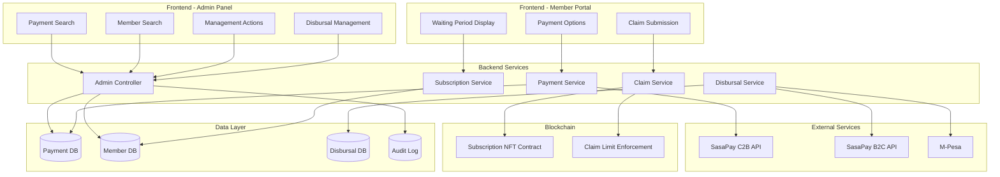
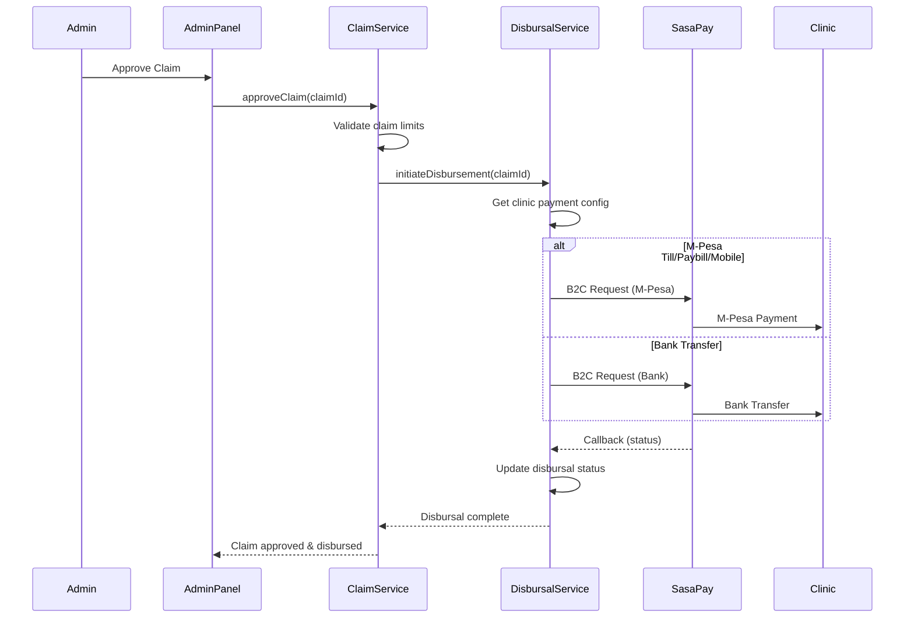
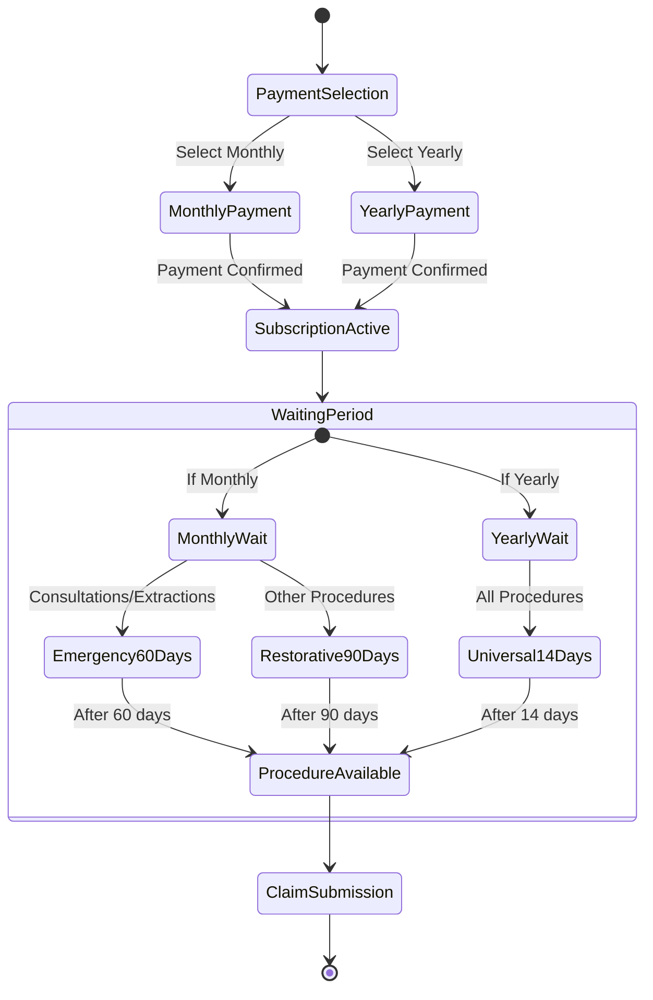

# Design Document: Comprehensive Platform Improvements

## Overview

This design implements six major feature enhancements to the MenoDAO platform: an admin panel for payment and member management, a robust clinic disbursal system supporting multiple payment channels, payment callback and redirect URL verification, subscription tier claim limit enforcement at both database and smart contract levels, differentiated waiting periods for monthly vs yearly payments, and a yearly payment option in the frontend.

The architecture extends the existing payment verification and authentication systems, adding administrative capabilities, improving payment reliability, and providing members with more flexible payment options. The design prioritizes data integrity, audit trails, and user experience while maintaining backward compatibility with existing subscriptions.

## Architecture

### High-Level System Architecture



### Disbursal Flow Architecture



### Payment Frequency and Waiting Period Flow



## Components and Interfaces

### Backend Components

#### 1. Admin Controller (`admin/admin.controller.ts`)

```typescript
interface PaymentSearchQuery {
  transactionId?: string;
  phoneNumber?: string;
  email?: string;
  status?: PaymentStatus;
  dateFrom?: Date;
  dateTo?: Date;
}

interface PaymentDetailResponse {
  id: string;
  transactionId: string;
  userId: string;
  userPhone: string;
  userEmail: string;
  amount: number;
  status: PaymentStatus;
  subscriptionType: string;
  paymentFrequency: 'MONTHLY' | 'ANNUAL';
  createdAt: Date;
  updatedAt: Date;
  confirmedAt?: Date;
  claimLimitsAssigned: boolean;
  claimLimitsAssignedAt?: Date;
  statusHistory: PaymentStatusHistoryEntry[];
  sasaPayData: {
    merchantRequestId?: string;
    checkoutRequestId?: string;
    mpesaReceiptNumber?: string;
  };
  relatedLinks: {
    userProfile: string;
    subscription: string;
    claims: string[];
  };
}

interface MemberSearchQuery {
  phoneNumber?: string;
  email?: string;
  memberId?: string;
}

interface MemberDetailResponse {
  id: string;
  fullName: string;
  phoneNumber: string;
  email: string;
  location: string;
  registrationDate: Date;
  accountStatus: 'ACTIVE' | 'SUSPENDED' | 'INACTIVE';
  subscription: {
    tier: 'BRONZE' | 'SILVER' | 'GOLD';
    status: 'ACTIVE' | 'INACTIVE';
    startDate: Date;
    paymentFrequency: 'MONTHLY' | 'ANNUAL';
    annualCapLimit: number;
    annualCapUsed: number;
    remainingLimit: number;
  };
  paymentHistory: PaymentSummary[];
  claimSummary: {
    totalClaims: number;
    totalAmountClaimed: number;
    remainingLimit: number;
  };
  waitingPeriodStatus: {
    consultationsExtractions: {
      available: boolean;
      daysRemaining: number;
    };
    restorativeProcedures: {
      available: boolean;
      daysRemaining: number;
    };
  };
}

interface AdminActionRequest {
  action: 'SUSPEND_MEMBER' | 'DEACTIVATE_SUBSCRIPTION' | 'VERIFY_PAYMENT' | 'REVERSE_DISBURSAL' | 'RETRY_DISBURSAL';
  targetId: string;
  reason: string;
  adminId: string;
}

interface AdminActionResponse {
  success: boolean;
  message: string;
  updatedRecord: any;
  auditLogId: string;
}

@Controller('admin')
@UseGuards(AdminAuthGuard)
class AdminController {
  @Get('payments/search')
  searchPayments(query: PaymentSearchQuery): Promise<PaymentDetailResponse[]>

  @Get('payments/:transactionId')
  getPaymentDetail(transactionId: string): Promise<PaymentDetailResponse>

  @Get('members/search')
  searchMembers(query: MemberSearchQuery): Promise<MemberDetailResponse[]>

  @Get('members/:memberId')
  getMemberDetail(memberId: string): Promise<MemberDetailResponse>

  @Post('actions/suspend-member')
  suspendMember(request: AdminActionRequest): Promise<AdminActionResponse>

  @Post('actions/deactivate-subscription')
  deactivateSubscription(request: AdminActionRequest): Promise<AdminActionResponse>

  @Post('actions/verify-payment')
  verifyPaymentManually(request: AdminActionRequest): Promise<AdminActionResponse>

  @Post('actions/reverse-disbursal')
  reverseDisburs al(request: AdminActionRequest): Promise<AdminActionResponse>

  @Post('actions/retry-disbursal')
  retryDisbursal(request: AdminActionRequest): Promise<AdminActionResponse>

  @Post('reconciliation/payments')
  reconcilePayments(dateRange: { from: Date; to: Date }): Promise<ReconciliationReport>
}
```

#### 2. Disbursal Service (`disbursals/disbursal.service.ts`)

```typescript
enum DisbursalStatus {
  PENDING = "pending",
  PROCESSING = "processing",
  COMPLETED = "completed",
  FAILED = "failed",
  REVERSED = "reversed",
}

enum PaymentChannel {
  MPESA_TILL = "MPESA_TILL",
  MPESA_PAYBILL = "MPESA_PAYBILL",
  MPESA_MOBILE = "MPESA_MOBILE",
  BANK_TRANSFER = "BANK_TRANSFER",
}

interface ClinicPaymentConfig {
  clinicId: string;
  paymentChannel: PaymentChannel;
  tillNumber?: string;
  paybillNumber?: string;
  mobileNumber?: string;
  bankAccount?: {
    accountNumber: string;
    bankName: string;
    branchCode: string;
  };
}

interface DisbursalRecord {
  id: string;
  claimId: string;
  clinicId: string;
  amount: number;
  status: DisbursalStatus;
  paymentChannel: PaymentChannel;
  transactionReference: string;
  recipientIdentifier: string; // Till/Paybill/Mobile/Account number
  sasaPayRequestId?: string;
  sasaPayCheckoutId?: string;
  mpesaReceiptNumber?: string;
  errorMessage?: string;
  createdAt: Date;
  updatedAt: Date;
  completedAt?: Date;
  reversedAt?: Date;
  statusHistory: DisbursalStatusHistoryEntry[];
}

interface InitiateDisbursementRequest {
  claimId: string;
  amount: number;
  clinicId: string;
}

class DisbursalService {
  async initiateDisbursement(
    request: InitiateDisbursementRequest,
  ): Promise<DisbursalRecord>;
  async processDisbursement(disbursalId: string): Promise<void>;
  async updateDisbursalStatus(
    disbursalId: string,
    status: DisbursalStatus,
    metadata?: any,
  ): Promise<void>;
  async reverseDisbursement(disbursalId: string, reason: string): Promise<void>;
  async retryDisbursement(disbursalId: string): Promise<void>;
  async getClinicPaymentConfig(clinicId: string): Promise<ClinicPaymentConfig>;
  private async sendMPesaTill(
    config: ClinicPaymentConfig,
    amount: number,
    reference: string,
  ): Promise<any>;
  private async sendMPesaPaybill(
    config: ClinicPaymentConfig,
    amount: number,
    reference: string,
  ): Promise<any>;
  private async sendMPesaMobile(
    config: ClinicPaymentConfig,
    amount: number,
    reference: string,
  ): Promise<any>;
  private async sendBankTransfer(
    config: ClinicPaymentConfig,
    amount: number,
    reference: string,
  ): Promise<any>;
}
```

#### 3. Enhanced Payment Service (`payments/payment.service.ts`)

```typescript
interface PaymentInitiationRequest {
  userId: string;
  tier: "BRONZE" | "SILVER" | "GOLD";
  paymentFrequency: "MONTHLY" | "ANNUAL";
}

interface PaymentInitiationResponse {
  transactionId: string;
  amount: number;
  callbackUrl: string;
  redirectUrl: string;
  checkoutUrl?: string;
}

interface URLConfig {
  apiBaseUrl: string;
  frontendBaseUrl: string;
  environment: "development" | "staging" | "production";
}

class PaymentService {
  async initiatePayment(
    request: PaymentInitiationRequest,
  ): Promise<PaymentInitiationResponse>;
  async calculatePaymentAmount(
    tier: string,
    frequency: "MONTHLY" | "ANNUAL",
  ): Promise<number>;
  async generateCallbackUrl(transactionId: string): Promise<string>;
  async generateRedirectUrl(transactionId: string): Promise<string>;
  async validateUrl(url: string): boolean;
  async handlePaymentCallback(payload: any, signature: string): Promise<void>;
  async assignClaimLimits(
    userId: string,
    tier: string,
    transactionId: string,
  ): Promise<void>;
  async setClaimLimitByTier(
    subscriptionId: string,
    tier: string,
  ): Promise<void>;
  async verifyPaymentWithSasaPay(transactionId: string): Promise<PaymentStatus>;
}
```

#### 4. Enhanced Subscription Service (`subscriptions/subscription.service.ts`)

```typescript
interface WaitingPeriodCheck {
  passed: boolean;
  daysRemaining: number;
  requiredDays: number;
  procedureType: "EMERGENCY" | "RESTORATIVE";
}

interface ClaimLimitCheck {
  withinLimit: boolean;
  currentUsed: number;
  limit: number;
  remainingLimit: number;
  wouldExceed: boolean;
}

interface SubscriptionCreationRequest {
  memberId: string;
  tier: "BRONZE" | "SILVER" | "GOLD";
  paymentFrequency: "MONTHLY" | "ANNUAL";
  transactionId: string;
}

class SubscriptionService {
  async createSubscription(
    request: SubscriptionCreationRequest,
  ): Promise<Subscription>;
  async checkWaitingPeriod(
    memberId: string,
    procedureCode: string,
  ): Promise<WaitingPeriodCheck>;
  async checkClaimLimit(
    memberId: string,
    claimAmount: number,
  ): Promise<ClaimLimitCheck>;
  async setClaimLimitByTier(
    subscriptionId: string,
    tier: string,
  ): Promise<void>;
  async incrementClaimUsage(memberId: string, amount: number): Promise<void>;
  async getWaitingPeriodStatus(memberId: string): Promise<WaitingPeriodStatus>;
  private calculateRequiredWaitingDays(
    paymentFrequency: string,
    procedureType: string,
  ): number;
}
```

#### 5. Audit Log Service (`audit/audit.service.ts`)

```typescript
interface AuditLogEntry {
  id: string;
  adminId: string;
  action: string;
  targetType: "PAYMENT" | "MEMBER" | "SUBSCRIPTION" | "DISBURSAL";
  targetId: string;
  reason: string;
  metadata: any;
  timestamp: Date;
  ipAddress: string;
}

class AuditLogService {
  async logAction(
    entry: Omit<AuditLogEntry, "id" | "timestamp">,
  ): Promise<AuditLogEntry>;
  async getActionHistory(targetId: string): Promise<AuditLogEntry[]>;
  async getAdminActions(
    adminId: string,
    dateRange?: { from: Date; to: Date },
  ): Promise<AuditLogEntry[]>;
}
```

### Frontend Components

#### 1. Admin Payment Search (`admin/components/PaymentSearch.tsx`)

```typescript
interface PaymentSearchProps {
  onPaymentSelected: (payment: PaymentDetailResponse) => void;
}

function PaymentSearch(props: PaymentSearchProps): JSX.Element;
```

#### 2. Admin Member Management (`admin/components/MemberManagement.tsx`)

```typescript
interface MemberManagementProps {
  memberId: string;
}

interface MemberAction {
  type: "SUSPEND" | "DEACTIVATE" | "VERIFY_PAYMENT";
  reason: string;
}

function MemberManagement(props: MemberManagementProps): JSX.Element;
```

#### 3. Payment Frequency Selector (`payment/components/PaymentFrequencySelector.tsx`)

```typescript
interface PaymentOption {
  frequency: "MONTHLY" | "ANNUAL";
  amount: number;
  totalAnnualCost: number;
  benefits: string[];
  waitingPeriod: string;
}

interface PaymentFrequencySelectorProps {
  tier: "BRONZE" | "SILVER" | "GOLD";
  monthlyPrice: number;
  onSelect: (frequency: "MONTHLY" | "ANNUAL", amount: number) => void;
}

function PaymentFrequencySelector(
  props: PaymentFrequencySelectorProps,
): JSX.Element;
```

#### 4. Waiting Period Display (`dashboard/components/WaitingPeriodDisplay.tsx`)

```typescript
interface WaitingPeriodDisplayProps {
  memberId: string;
}

interface ProcedureWaitingStatus {
  category: string;
  procedures: string[];
  available: boolean;
  daysRemaining: number;
  requiredDays: number;
}

function WaitingPeriodDisplay(props: WaitingPeriodDisplayProps): JSX.Element;
```

## Data Models

### Enhanced Payment Model

```prisma
model Payment {
  id                    String        @id @default(cuid())
  transactionId         String        @unique
  userId                String
  amount                Decimal       @db.Decimal(10, 2)
  status                PaymentStatus @default(PENDING)
  subscriptionType      String
  paymentFrequency      PaymentFrequency @default(MONTHLY)
  claimLimitsAssigned   Boolean       @default(false)
  claimLimitsAssignedAt DateTime?
  createdAt             DateTime      @default(now())
  updatedAt             DateTime      @updatedAt
  confirmedAt           DateTime?

  // SasaPay fields
  merchantRequestId     String?
  checkoutRequestId     String?
  mpesaReceiptNumber    String?

  // URLs
  callbackUrl           String
  redirectUrl           String

  user                  User          @relation(fields: [userId], references: [id])
  statusHistory         PaymentStatusHistory[]

  @@index([transactionId])
  @@index([userId])
  @@index([status])
  @@index([createdAt])
}

enum PaymentFrequency {
  MONTHLY
  ANNUAL
}
```

### Disbursal Model

```prisma
model Disbursal {
  id                    String            @id @default(cuid())
  claimId               String            @unique
  clinicId              String
  amount                Decimal           @db.Decimal(10, 2)
  status                DisbursalStatus   @default(PENDING)
  paymentChannel        PaymentChannel
  transactionReference  String            @unique
  recipientIdentifier   String

  // SasaPay fields
  sasaPayRequestId      String?
  sasaPayCheckoutId     String?
  mpesaReceiptNumber    String?

  errorMessage          String?
  createdAt             DateTime          @default(now())
  updatedAt             DateTime          @updatedAt
  completedAt           DateTime?
  reversedAt            DateTime?
  reversalReason        String?

  claim                 Claim             @relation(fields: [claimId], references: [id])
  clinic                Clinic            @relation(fields: [clinicId], references: [id])
  statusHistory         DisbursalStatusHistory[]

  @@index([claimId])
  @@index([clinicId])
  @@index([status])
  @@index([createdAt])
}

enum DisbursalStatus {
  PENDING
  PROCESSING
  COMPLETED
  FAILED
  REVERSED
}

enum PaymentChannel {
  MPESA_TILL
  MPESA_PAYBILL
  MPESA_MOBILE
  BANK_TRANSFER
}

model DisbursalStatusHistory {
  id            String          @id @default(cuid())
  disbursalId   String
  status        DisbursalStatus
  timestamp     DateTime        @default(now())
  metadata      Json?

  disbursal     Disbursal       @relation(fields: [disbursalId], references: [id])

  @@index([disbursalId])
  @@index([timestamp])
}
```

### Enhanced Subscription Model

```prisma
model Subscription {
  id                      String            @id @default(cuid())
  memberId                String            @unique
  tier                    PackageTier
  isActive                Boolean           @default(true)
  paymentFrequency        PaymentFrequency  @default(MONTHLY)
  monthlyAmount           Decimal           @db.Decimal(10, 2)
  annualCapLimit          Int               // KES: Bronze=6000, Silver=10000, Gold=15000
  annualCapUsed           Int               @default(0)
  subscriptionStartDate   DateTime?
  subscriptionEndDate     DateTime?
  lastResetDate           DateTime          @default(now())
  procedureUsageCount     Json              @default("{}")

  member                  Member            @relation(fields: [memberId], references: [id])

  @@index([memberId])
  @@index([tier])
  @@index([isActive])
}
```

### Clinic Payment Configuration Model

```prisma
model ClinicPaymentConfig {
  id                String         @id @default(cuid())
  clinicId          String         @unique
  paymentChannel    PaymentChannel

  // M-Pesa fields
  tillNumber        String?
  paybillNumber     String?
  mobileNumber      String?

  // Bank fields
  bankAccountNumber String?
  bankName          String?
  bankBranchCode    String?

  createdAt         DateTime       @default(now())
  updatedAt         DateTime       @updatedAt

  clinic            Clinic         @relation(fields: [clinicId], references: [id])

  @@index([clinicId])
}
```

### Audit Log Model

```prisma
model AuditLog {
  id          String   @id @default(cuid())
  adminId     String
  action      String
  targetType  String
  targetId    String
  reason      String
  metadata    Json?
  timestamp   DateTime @default(now())
  ipAddress   String

  admin       Admin    @relation(fields: [adminId], references: [id])

  @@index([adminId])
  @@index([targetType, targetId])
  @@index([timestamp])
}
```

## Correctness Properties

_A property is a characteristic or behavior that should hold true across all valid executions of a system—essentially, a formal statement about what the system should do. Properties serve as the bridge between human-readable specifications and machine-verifiable correctness guarantees._

### Property 1: Payment Search Returns Matching Records

_For any_ payment search query with a transaction ID, the search results should include only payments whose transaction ID matches the query.

**Validates: Requirements 1.1**

### Property 2: Payment Display Completeness

_For any_ payment record displayed in the admin panel, the display should include all required fields: transaction ID, user ID, amount, status, subscription type, payment frequency, created timestamp, updated timestamp, and confirmed timestamp.

**Validates: Requirements 1.2**

### Property 3: Payment Status History Completeness

_For any_ payment with status transitions, the admin panel display should include all status history entries with their timestamps.

**Validates: Requirements 1.3**

### Property 4: Claim Limits Display Conditional

_For any_ payment record, if claim limits were assigned, the display should show the assignment status and timestamp; if not assigned, these fields should be absent or marked as not assigned.

**Validates: Requirements 1.4**

### Property 5: Member Search Returns Matching Profiles

_For any_ member search query with phone number or email, the search results should include only members whose phone number or email matches the query.

**Validates: Requirements 2.1**

### Property 6: Member Display Privacy Compliance

_For any_ member profile displayed in the admin panel, the display should include profile and subscription information but should NOT include actual treatment details or medical information.

**Validates: Requirements 2.2, 2.3, 2.4, 2.5, 2.6**

### Property 7: Suspend Member State Transition

_For any_ active member, when the suspend action is performed, the member's account status should change to "SUSPENDED".

**Validates: Requirements 3.1**

### Property 8: Suspended Member Payment Prevention

_For any_ suspended member, attempts to initiate new payments or submit claims should be rejected.

**Validates: Requirements 3.2**

### Property 9: Deactivate Subscription State Transition

_For any_ active subscription, when the deactivate action is performed, the subscription status should change to "INACTIVE" and claim limits should be revoked.

**Validates: Requirements 3.3, 3.4**

### Property 10: Manual Payment Verification Updates Status

_For any_ payment with pending status, when manual verification is performed and SasaPay confirms success, the payment status should be updated to "SUCCESS" and claim limits should be assigned if not already assigned.

**Validates: Requirements 3.5, 3.6**

### Property 11: Admin Action Audit Trail

_For any_ administrative action (suspend, deactivate, verify, reverse, retry), an audit log entry should be created with administrator ID, action type, target ID, reason, and timestamp.

**Validates: Requirements 3.8**

### Property 12: Disbursal Reversal State Transition

_For any_ completed disbursal, when the reverse action is performed, the disbursal status should change to "REVERSED" and the associated claim status should be updated.

**Validates: Requirements 4.1, 4.2**

### Property 13: Disbursal Retry Reattempts Payment

_For any_ failed disbursal, when the retry action is performed, a new payment attempt should be initiated using the same payment details.

**Validates: Requirements 4.3, 4.4**

### Property 14: Payment Channel Selection

_For any_ clinic with a configured payment channel, disbursals to that clinic should use the configured channel type (Till, Paybill, Mobile, or Bank).

**Validates: Requirements 5.1, 5.2, 5.3, 5.4, 5.5**

### Property 15: Bank Transfer API Compliance

_For any_ disbursal using bank transfer channel, the SasaPay B2C API request should include bank account number, bank name, and branch code as specified in the SasaPay B2C API documentation.

**Validates: Requirements 6.1, 6.2, 6.3, 6.4, 6.5**

### Property 16: Disbursal Status Lifecycle

_For any_ disbursal, the status should transition through valid states only: pending → processing → (completed | failed), and completed → reversed is allowed.

**Validates: Requirements 7.1, 7.2, 7.3, 7.4, 7.5, 7.6**

### Property 17: Disbursal Amount Accuracy

_For any_ approved claim, the disbursal amount should equal the claim amount and should not exceed the member's remaining claim limit.

**Validates: Requirements 8.1, 8.2**

### Property 18: Disbursal Duplicate Prevention

_For any_ claim, only one disbursal record should exist, preventing duplicate payments to the clinic.

**Validates: Requirements 8.5**

### Property 19: Failed Disbursal Claim Limit Preservation

_For any_ disbursal that fails, the member's claim limit should not be deducted.

**Validates: Requirements 8.6**

### Property 20: Reversed Disbursal Claim Limit Restoration

_For any_ disbursal that is reversed, the member's claim limit should be restored by the disbursal amount.

**Validates: Requirements 8.7**

### Property 21: Callback URL Format Correctness

_For any_ payment initiation, the generated callback URL should be in the format `{apiBaseUrl}/payments/callback` and should be a valid HTTPS URL.

**Validates: Requirements 9.1, 9.2, 9.3, 9.4, 9.5**

### Property 22: Redirect URL Format Correctness

_For any_ payment initiation, the generated redirect URL should be in the format `{frontendBaseUrl}/payment/status?transactionId={id}` and should be a valid HTTPS URL.

**Validates: Requirements 10.1, 10.2, 10.3, 10.4, 10.5, 10.6**

### Property 23: Claim Limit Tier Assignment

_For any_ subscription, the annual cap limit should be set according to tier: Bronze=6000, Silver=10000, Gold=15000.

**Validates: Requirements 12.1, 12.2, 12.3, 12.4**

### Property 24: Claim Limit Enforcement at Submission

_For any_ claim submission, if the claim amount plus current annual cap used exceeds the annual cap limit, the claim should be rejected with a descriptive error.

**Validates: Requirements 12.5, 12.6, 14.1, 14.2, 14.3**

### Property 25: Smart Contract Claim Limit Enforcement

_For any_ on-chain claim submission, if the claim amount plus current usage exceeds the tier limit stored in the smart contract, the transaction should revert.

**Validates: Requirements 13.1, 13.2, 13.3, 13.4**

### Property 26: Monthly Payment Emergency Procedure Waiting Period

_For any_ subscription with payment frequency "MONTHLY", consultations and extractions should require a 60-day waiting period from subscription start date.

**Validates: Requirements 15.1, 15.2**

### Property 27: Monthly Payment Restorative Procedure Waiting Period

_For any_ subscription with payment frequency "MONTHLY", root canal, scaling, filling, and antibiotics should require a 90-day waiting period from subscription start date.

**Validates: Requirements 15.3**

### Property 28: Monthly Payment Waiting Period Enforcement

_For any_ claim submission by a monthly subscriber before the required waiting period, the claim should be rejected with days remaining shown.

**Validates: Requirements 15.4, 15.5**

### Property 29: Annual Payment Universal Waiting Period

_For any_ subscription with payment frequency "ANNUAL", all procedures should require only a 14-day waiting period from subscription start date.

**Validates: Requirements 16.1, 16.2, 16.3**

### Property 30: Waiting Period Function Correctness

_For any_ member and procedure code, the checkWaitingPeriod function should return the correct waiting period status based on payment frequency, procedure type, and days since subscription start.

**Validates: Requirements 17.1, 17.2, 17.3, 17.4, 17.5, 17.6**

### Property 31: Yearly Payment Amount Calculation

_For any_ tier and yearly payment selection, the payment amount should equal the tier's monthly price multiplied by 12.

**Validates: Requirements 20.1, 20.2, 20.3**

### Property 32: Payment Frequency Storage

_For any_ subscription created with yearly payment, the payment frequency field should be set to "ANNUAL" and the subscription start date should be set to the payment confirmation date.

**Validates: Requirements 20.4, 20.5**

### Property 33: Payment Migration Idempotency

_For any_ subscription, running the payment frequency migration multiple times should result in the same final state (paymentFrequency="MONTHLY" for existing subscriptions).

**Validates: Requirements 23.1, 23.2, 23.7**

### Property 34: Payment Reconciliation Discrepancy Detection

_For any_ payment in a date range, if the local status differs from the SasaPay status, the reconciliation tool should flag it as a discrepancy.

**Validates: Requirements 24.1, 24.2, 24.3, 24.4**

### Property 35: Error Logging Completeness

_For any_ error during payment processing, disbursal, or claim submission, a log entry should be created with full error context including stack trace and relevant IDs.

**Validates: Requirements 25.1, 25.2, 25.3, 25.4, 25.5, 25.6**

## Error Handling

### Error Categories

1. **Admin Action Errors**
   - Member not found
   - Payment not found
   - Insufficient permissions
   - Invalid action for current state
   - Response: Return descriptive error, log action attempt

2. **Disbursal Errors**
   - Clinic payment config not found
   - SasaPay API failure
   - Invalid payment channel
   - Insufficient funds
   - Response: Mark disbursal as failed, log error, allow retry

3. **Payment Callback Errors**
   - Invalid signature
   - Malformed payload
   - Transaction not found
   - Response: Reject request, log security warning

4. **Claim Limit Errors**
   - Limit exceeded
   - Subscription inactive
   - Waiting period not met
   - Response: Reject claim, return descriptive error with details

5. **URL Generation Errors**
   - Missing environment configuration
   - Invalid URL format
   - Response: Log error, use fallback URL, alert admin

### Error Response Format

```typescript
interface ErrorResponse {
  success: false;
  error: {
    code: string;
    message: string;
    details?: any;
    retryable: boolean;
    timestamp: Date;
  };
}
```

### Specific Error Scenarios

1. **Claim Limit Exceeded (Requirement 14.3)**
   - Error Code: `CLAIM_LIMIT_EXCEEDED`
   - Message: "Claim amount exceeds remaining limit"
   - Details: `{ currentUsed, limit, claimAmount, excess }`
   - Retryable: false

2. **Waiting Period Not Met (Requirement 15.4)**
   - Error Code: `WAITING_PERIOD_NOT_MET`
   - Message: "Procedure not available yet"
   - Details: `{ procedure, daysRemaining, requiredDays }`
   - Retryable: false (wait required)

3. **Disbursal Failed (Requirement 6.6)**
   - Error Code: `DISBURSAL_FAILED`
   - Message: "Payment to clinic failed"
   - Details: `{ clinicId, amount, sasaPayError }`
   - Retryable: true

4. **Invalid Payment Channel (Requirement 5.7)**
   - Error Code: `PAYMENT_CHANNEL_NOT_CONFIGURED`
   - Message: "Clinic payment method not configured"
   - Details: `{ clinicId }`
   - Retryable: false (requires configuration)

## Testing Strategy

### Dual Testing Approach

This feature requires both unit tests and property-based tests:

**Unit Tests** focus on:

- Specific admin actions (suspend, deactivate, verify)
- Error scenarios (invalid inputs, missing configs)
- URL generation for different environments
- Payment frequency migration script
- Disbursal retry logic
- Callback signature validation

**Property-Based Tests** focus on:

- Search functionality across various queries
- Claim limit enforcement across all tiers and amounts
- Waiting period calculations across all payment frequencies and procedure types
- Disbursal status transitions across all valid state changes
- Payment amount calculations across all tiers and frequencies
- Audit log creation for all admin actions

### Property-Based Testing Configuration

- **Library**: fast-check (TypeScript property-based testing)
- **Iterations**: Minimum 100 runs per property test
- **Tagging**: Each test references its design property:
  ```typescript
  // Feature: comprehensive-platform-improvements, Property 1: Payment Search Returns Matching Records
  ```

### Test Organization

**Backend Tests:**

```
src/admin/
  ├── admin.controller.spec.ts              # Unit tests for admin endpoints
  ├── admin.service.property.spec.ts        # Property tests for admin logic
src/disbursals/
  ├── disbursal.service.spec.ts             # Unit tests for disbursal service
  ├── disbursal.service.property.spec.ts    # Property tests for disbursal logic
src/payments/
  ├── payment-urls.spec.ts                  # Unit tests for URL generation
  ├── payment-frequency.spec.ts             # Unit tests for frequency handling
src/subscriptions/
  ├── waiting-period.spec.ts                # Unit tests for waiting period logic
  ├── waiting-period.property.spec.ts       # Property tests for waiting periods
  ├── claim-limits.property.spec.ts         # Property tests for claim limits
```

**Frontend Tests:**

```
src/app/admin/
  ├── components/PaymentSearch.test.tsx
  ├── components/MemberManagement.test.tsx
src/app/payment/
  ├── components/PaymentFrequencySelector.test.tsx
src/app/dashboard/
  ├── components/WaitingPeriodDisplay.test.tsx
```

### Key Test Scenarios

**Unit Test Examples:**

- Suspend member action updates status and creates audit log
- Deactivate subscription revokes claim limits
- Manual payment verification queries SasaPay and updates status
- Disbursal retry creates new payment attempt
- URL generation uses correct base URL for environment
- Payment frequency migration sets MONTHLY for existing subscriptions

**Property Test Examples:**

- For all payment searches, results match query criteria
- For all claim submissions, limits are enforced correctly
- For all waiting period checks, correct days are calculated
- For all disbursal state transitions, only valid transitions occur
- For all yearly payments, amount equals monthly \* 12
- For all admin actions, audit logs are created

### Integration Testing

- Test complete admin workflow: search → view → action → verify
- Test complete disbursal flow: approve claim → initiate → callback → complete
- Test complete payment flow: select frequency → pay → callback → assign limits
- Test waiting period enforcement: subscribe → wait → claim → verify
- Test claim limit enforcement: subscribe → claim → verify limit deduction

### Smart Contract Testing

- Test claim limit enforcement on-chain
- Test tier limit storage and retrieval
- Test claim submission with various amounts
- Test limit exceeded scenarios
- Test cumulative usage tracking
