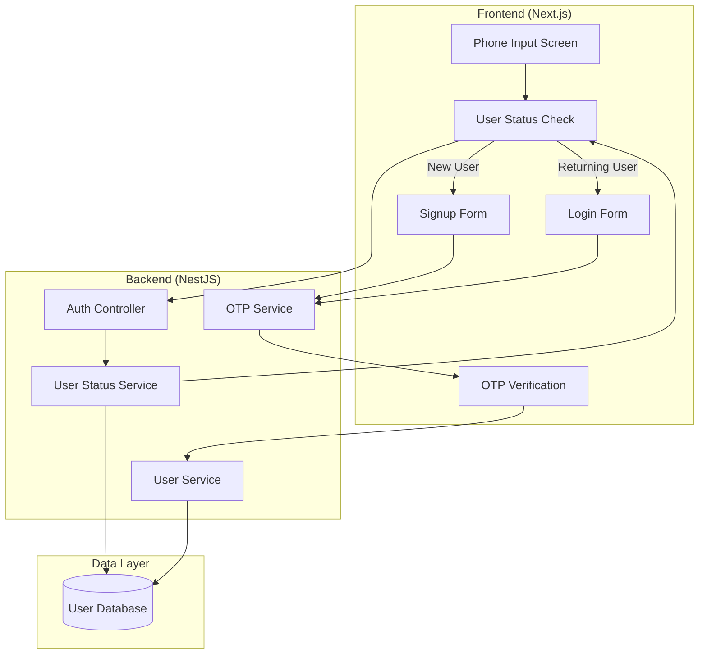

# Design Document: Improved Authentication Flow

## Overview

This design implements a user-aware authentication system that distinguishes between new user signup and returning user login flows. The solution introduces a user status detection endpoint, separate UI flows for signup and login, and proper terms and conditions compliance tracking.

The architecture follows a clean separation between frontend presentation logic and backend authentication services, leveraging the existing NestJS backend and Next.js frontend infrastructure. The design prioritizes user experience by providing contextually appropriate interfaces while maintaining security through OTP verification.

## Architecture

### High-Level Architecture



### Component Interaction Flow

**New User Signup Flow:**

1. User enters phone number
2. Frontend calls `/auth/check-status` endpoint
3. Backend queries database for phone number
4. Backend returns `{ exists: false, isNewUser: true }`
5. Frontend displays signup form with name, location, phone, and T&C checkbox
6. User fills form and accepts terms
7. Frontend calls `/auth/signup` with user data
8. Backend generates OTP and sends via SMS
9. Frontend navigates to OTP verification screen
10. User enters OTP
11. Frontend calls `/auth/verify-otp` with OTP and signup data
12. Backend verifies OTP and creates user record with T&C acceptance timestamp
13. User is authenticated and redirected to dashboard

**Returning User Login Flow:**

1. User enters phone number
2. Frontend calls `/auth/check-status` endpoint
3. Backend queries database for phone number
4. Backend returns `{ exists: true, isNewUser: false, userId: "..." }`
5. Frontend displays login form with only phone number
6. Frontend calls `/auth/login` with phone number
7. Backend generates OTP and sends via SMS
8. Frontend navigates to OTP verification screen
9. User enters OTP
10. Frontend calls `/auth/verify-otp` with OTP
11. Backend verifies OTP and authenticates existing user
12. User is authenticated and redirected to dashboard

## Components and Interfaces

### Backend Components

#### 1. Auth Controller (`auth.controller.ts`)

```typescript
interface CheckStatusRequest {
  phoneNumber: string;
}

interface CheckStatusResponse {
  exists: boolean;
  isNewUser: boolean;
  userId?: string;
}

interface SignupRequest {
  phoneNumber: string;
  fullName: string;
  location: string;
  termsAccepted: boolean;
}

interface LoginRequest {
  phoneNumber: string;
}

interface OTPResponse {
  success: boolean;
  message: string;
  sessionId: string;
}

interface VerifyOTPRequest {
  sessionId: string;
  otp: string;
  signupData?: SignupRequest;
}

interface VerifyOTPResponse {
  success: boolean;
  token: string;
  user: UserProfile;
}

@Controller('auth')
class AuthController {
  @Post('check-status')
  checkUserStatus(body: CheckStatusRequest): Promise<CheckStatusResponse>

  @Post('signup')
  initiateSignup(body: SignupRequest): Promise<OTPResponse>

  @Post('login')
  initiateLogin(body: LoginRequest): Promise<OTPResponse>

  @Post('verify-otp')
  verifyOTP(body: VerifyOTPRequest): Promise<VerifyOTPResponse>
}
```

#### 2. User Status Service (`user-status.service.ts`)

```typescript
interface UserStatusResult {
  exists: boolean;
  userId?: string;
}

class UserStatusService {
  async checkUserExists(phoneNumber: string): Promise<UserStatusResult>;
}
```

#### 3. OTP Service (`otp.service.ts`)

```typescript
interface OTPSession {
  sessionId: string;
  phoneNumber: string;
  otp: string;
  expiresAt: Date;
  createdAt: Date;
}

class OTPService {
  async generateAndSendOTP(phoneNumber: string): Promise<string>;
  async verifyOTP(sessionId: string, otp: string): Promise<boolean>;
  async getSession(sessionId: string): Promise<OTPSession | null>;
  async invalidateSession(sessionId: string): Promise<void>;
}
```

#### 4. User Service (`user.service.ts`)

```typescript
interface CreateUserData {
  phoneNumber: string;
  fullName: string;
  location: string;
  termsAcceptedAt: Date;
}

interface UserProfile {
  id: string;
  phoneNumber: string;
  fullName: string;
  location: string;
  termsAcceptedAt: Date;
  createdAt: Date;
}

class UserService {
  async createUser(data: CreateUserData): Promise<UserProfile>;
  async getUserByPhone(phoneNumber: string): Promise<UserProfile | null>;
  async getUserById(userId: string): Promise<UserProfile | null>;
}
```

### Frontend Components

#### 1. Phone Input Screen (`PhoneInputScreen.tsx`)

```typescript
interface PhoneInputScreenProps {
  onStatusChecked: (status: CheckStatusResponse) => void;
}

function PhoneInputScreen(props: PhoneInputScreenProps): JSX.Element;
```

#### 2. Signup Form (`SignupForm.tsx`)

```typescript
interface SignupFormProps {
  initialPhoneNumber: string;
  onSubmit: (data: SignupRequest) => Promise<void>;
}

interface SignupFormData {
  phoneNumber: string;
  fullName: string;
  location: string;
  termsAccepted: boolean;
}

function SignupForm(props: SignupFormProps): JSX.Element;
```

#### 3. Login Form (`LoginForm.tsx`)

```typescript
interface LoginFormProps {
  phoneNumber: string;
  onSubmit: (phoneNumber: string) => Promise<void>;
}

function LoginForm(props: LoginFormProps): JSX.Element;
```

#### 4. OTP Verification Screen (`OTPVerificationScreen.tsx`)

```typescript
interface OTPVerificationScreenProps {
  sessionId: string;
  phoneNumber: string;
  signupData?: SignupRequest;
  onVerified: (response: VerifyOTPResponse) => void;
}

function OTPVerificationScreen(props: OTPVerificationScreenProps): JSX.Element;
```

#### 5. Auth Flow Orchestrator (`AuthFlowOrchestrator.tsx`)

```typescript
type AuthFlowState =
  | { step: "phone-input" }
  | { step: "signup"; phoneNumber: string }
  | { step: "login"; phoneNumber: string }
  | {
      step: "otp-verification";
      sessionId: string;
      phoneNumber: string;
      signupData?: SignupRequest;
    }
  | { step: "complete"; user: UserProfile };

function AuthFlowOrchestrator(): JSX.Element;
```

## Data Models

### User Model (Prisma Schema)

```prisma
model User {
  id                String    @id @default(cuid())
  phoneNumber       String    @unique
  fullName          String
  location          String
  termsAcceptedAt   DateTime
  createdAt         DateTime  @default(now())
  updatedAt         DateTime  @updatedAt

  // Existing relations
  subscriptions     Subscription[]
  visits            Visit[]

  @@index([phoneNumber])
}
```

### OTP Session Model (In-Memory or Redis)

```typescript
interface OTPSession {
  sessionId: string;
  phoneNumber: string;
  otp: string;
  expiresAt: Date;
  createdAt: Date;
  attempts: number;
}
```

## Correctness Properties

_A property is a characteristic or behavior that should hold true across all valid executions of a system—essentially, a formal statement about what the system should do. Properties serve as the bridge between human-readable specifications and machine-verifiable correctness guarantees._

### Property 1: User Status Detection Accuracy

_For any_ phone number, when checking user status, the system should return `exists: true` if and only if that phone number exists in the database, and should return the correct `isNewUser` flag accordingly.

**Validates: Requirements 1.1, 1.2, 1.3**

### Property 2: Signup Form Validation State

_For any_ signup form data, the submit button should be enabled if and only if all required fields (fullName, location, phoneNumber) are non-empty and termsAccepted is true.

**Validates: Requirements 2.4, 2.5**

### Property 3: OTP Generation and Delivery

_For any_ valid authentication request (signup or login), when the request is processed, an OTP should be generated and sent to the provided phone number, returning a valid sessionId.

**Validates: Requirements 2.6, 3.4**

### Property 4: User Creation with Complete Data

_For any_ successful signup with OTP verification, the created user record should contain all provided profile information (fullName, location, phoneNumber) and a termsAcceptedAt timestamp.

**Validates: Requirements 2.8, 5.3, 5.4, 5.5**

### Property 5: OTP Validation Logic

_For any_ OTP verification attempt, the verification should succeed if and only if the OTP matches the generated code, the session is valid, and the OTP has not expired (less than 10 minutes old).

**Validates: Requirements 4.2, 4.3, 4.4, 4.5**

### Property 6: Login Without Profile Collection

_For any_ returning user OTP verification, the authentication should succeed without requiring or collecting additional profile information (fullName, location).

**Validates: Requirements 3.6**

### Property 7: Phone Number Format Validation

_For any_ phone number input, if the format is invalid (not matching the expected pattern), a validation error should be displayed before any API calls are made.

**Validates: Requirements 7.1**

### Property 8: Authentication Error Logging

_For any_ authentication error (status check failure, OTP sending failure, verification failure), an error log entry should be created with relevant context information.

**Validates: Requirements 7.5**

## Error Handling

### Error Categories

1. **Validation Errors**
   - Invalid phone number format
   - Missing required fields
   - Terms not accepted
   - Response: 400 Bad Request with field-specific error messages

2. **Authentication Errors**
   - Invalid OTP
   - Expired OTP
   - Invalid session
   - Response: 401 Unauthorized with descriptive message

3. **Service Errors**
   - Database unavailable
   - SMS service failure
   - Response: 503 Service Unavailable with retry guidance

4. **Network Errors**
   - Timeout
   - Connection failure
   - Response: Client-side retry with exponential backoff

### Error Response Format

```typescript
interface ErrorResponse {
  success: false;
  error: {
    code: string;
    message: string;
    field?: string;
    retryable: boolean;
  };
}
```

### Error Handling Strategy

**Backend:**

- Use NestJS exception filters for consistent error formatting
- Log all errors with correlation IDs for tracing
- Return appropriate HTTP status codes
- Include retry guidance for transient failures

**Frontend:**

- Display user-friendly error messages
- Provide retry buttons for retryable errors
- Maintain form state on errors
- Log errors to monitoring service

### Specific Error Scenarios

1. **Database Query Failure (Requirement 1.5)**
   - Log error with stack trace
   - Return 503 Service Unavailable
   - Message: "Service temporarily unavailable. Please try again."

2. **OTP Sending Failure (Requirement 7.2)**
   - Log error with phone number (masked)
   - Return 503 Service Unavailable
   - Message: "Unable to send verification code. Please try again."

3. **Invalid OTP (Requirement 4.4)**
   - Increment attempt counter
   - Return 401 Unauthorized
   - Message: "Invalid verification code. Please try again."

4. **Expired OTP (Requirement 4.4)**
   - Invalidate session
   - Return 401 Unauthorized
   - Message: "Verification code expired. Please request a new code."

## Testing Strategy

### Dual Testing Approach

This feature requires both unit tests and property-based tests to ensure comprehensive coverage:

**Unit Tests** focus on:

- Specific UI component rendering (signup form displays correct fields, login form displays correct fields)
- Specific error scenarios (database failure, SMS failure, network errors)
- Navigation flows (phone input → signup → OTP → complete)
- Edge cases (expired OTP, invalid session, malformed data)

**Property-Based Tests** focus on:

- User status detection across all phone numbers
- Form validation logic across all input combinations
- OTP generation and validation across all valid/invalid codes
- User creation with various profile data combinations
- Error logging across all error types

### Property-Based Testing Configuration

- **Library**: fast-check (TypeScript/JavaScript property-based testing library)
- **Iterations**: Minimum 100 runs per property test
- **Tagging**: Each test must reference its design property using the format:
  ```typescript
  // Feature: improved-authentication-flow, Property 1: User Status Detection Accuracy
  ```

### Test Organization

**Backend Tests:**

```
src/auth/
  ├── auth.controller.spec.ts          # Unit tests for controller endpoints
  ├── auth.controller.property.spec.ts # Property tests for auth logic
  ├── user-status.service.spec.ts      # Unit tests for status service
  ├── otp.service.spec.ts              # Unit tests for OTP service
  └── otp.service.property.spec.ts     # Property tests for OTP validation
```

**Frontend Tests:**

```
src/app/auth/
  ├── PhoneInputScreen.test.tsx        # Unit tests for phone input
  ├── SignupForm.test.tsx              # Unit tests for signup form
  ├── SignupForm.property.test.tsx     # Property tests for form validation
  ├── LoginForm.test.tsx               # Unit tests for login form
  ├── OTPVerificationScreen.test.tsx   # Unit tests for OTP screen
  └── AuthFlowOrchestrator.test.tsx    # Integration tests for flow
```

### Key Test Scenarios

**Unit Test Examples:**

- Signup form renders with all required fields
- Login form renders with only phone field
- Terms checkbox prevents submission when unchecked
- OTP verification screen displays error on invalid code
- Navigation occurs after successful OTP verification

**Property Test Examples:**

- For all phone numbers in database, status check returns exists=true
- For all valid signup data with terms accepted, form is submittable
- For all valid OTP codes within 10 minutes, verification succeeds
- For all expired OTP codes, verification fails with appropriate error
- For all authentication errors, a log entry is created

### Integration Testing

- Test complete signup flow: phone → status check → signup form → OTP → user creation
- Test complete login flow: phone → status check → login form → OTP → authentication
- Test error recovery: failed OTP → retry → success
- Test session management: OTP expiration → new OTP request → success
