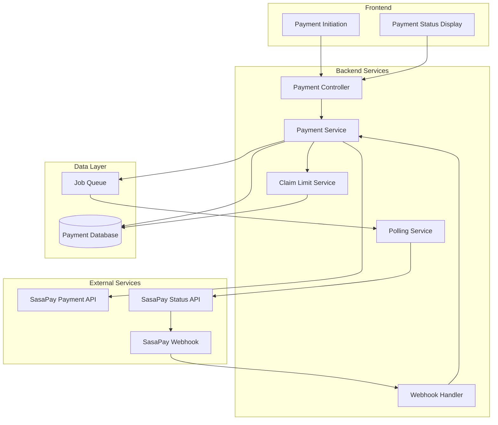
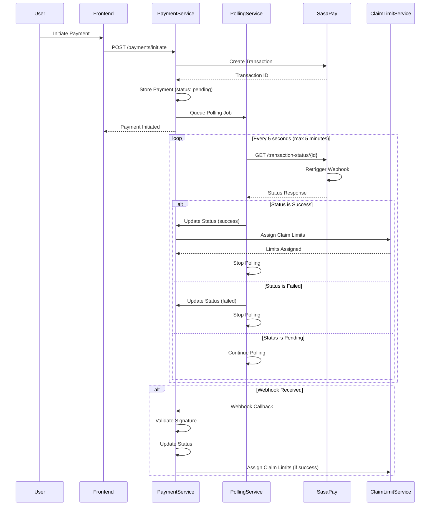

# Design Document: Payment Verification Fix

## Overview

This design implements a robust payment verification system that prevents premature claim limit assignment by polling the SasaPay transaction status API until payment confirmation. The solution introduces a polling service that continuously checks payment status, a state machine for payment lifecycle management, and proper webhook handling to ensure claim limits are only assigned after confirmed successful payments.

The architecture uses a job queue for managing concurrent payment verifications, implements retry logic for resilience, and provides reconciliation tools for fixing existing ghost-success scenarios. The design prioritizes reliability and accuracy over speed, ensuring no user receives services without valid payment.

## Architecture

### High-Level Architecture



### Payment Verification Flow



## Components and Interfaces

### Backend Components

#### 1. Payment Controller (`payments.controller.ts`)

```typescript
interface InitiatePaymentRequest {
  userId: string;
  amount: number;
  subscriptionType: string;
}

interface InitiatePaymentResponse {
  transactionId: string;
  status: PaymentStatus;
  checkoutUrl?: string;
}

interface PaymentStatusResponse {
  transactionId: string;
  status: PaymentStatus;
  amount: number;
  createdAt: Date;
  updatedAt: Date;
  claimLimitsAssigned: boolean;
}

interface ReconcilePaymentRequest {
  transactionId: string;
}

@Controller('payments')
class PaymentsController {
  @Post('initiate')
  initiatePayment(body: InitiatePaymentRequest): Promise<InitiatePaymentResponse>

  @Get('status/:transactionId')
  getPaymentStatus(transactionId: string): Promise<PaymentStatusResponse>

  @Post('reconcile')
  reconcilePayment(body: ReconcilePaymentRequest): Promise<PaymentStatusResponse>

  @Get('pending')
  getPendingPayments(): Promise<PaymentStatusResponse[]>

  @Post('webhook')
  handleWebhook(body: any, signature: string): Promise<void>
}
```

#### 2. Payment Service (`payment.service.ts`)

```typescript
enum PaymentStatus {
  PENDING = "pending",
  SUCCESS = "success",
  FAILED = "failed",
  CANCELLED = "cancelled",
  TIMEOUT = "timeout",
}

interface PaymentRecord {
  id: string;
  transactionId: string;
  userId: string;
  amount: number;
  status: PaymentStatus;
  subscriptionType: string;
  claimLimitsAssigned: boolean;
  createdAt: Date;
  updatedAt: Date;
  confirmedAt?: Date;
}

interface CreatePaymentData {
  transactionId: string;
  userId: string;
  amount: number;
  subscriptionType: string;
}

class PaymentService {
  async createPayment(data: CreatePaymentData): Promise<PaymentRecord>;
  async updatePaymentStatus(
    transactionId: string,
    status: PaymentStatus,
  ): Promise<PaymentRecord>;
  async getPaymentByTransactionId(
    transactionId: string,
  ): Promise<PaymentRecord | null>;
  async getPendingPayments(olderThanMinutes: number): Promise<PaymentRecord[]>;
  async markClaimLimitsAssigned(transactionId: string): Promise<void>;
}
```

#### 3. Polling Service (`polling.service.ts`)

```typescript
interface PollingJob {
  id: string;
  transactionId: string;
  startedAt: Date;
  lastPolledAt: Date;
  pollCount: number;
  maxPolls: number;
}

interface PollingConfig {
  intervalSeconds: number;
  maxDurationMinutes: number;
  maxRetries: number;
}

class PollingService {
  async startPolling(transactionId: string): Promise<void>;
  async stopPolling(transactionId: string): Promise<void>;
  async pollTransactionStatus(transactionId: string): Promise<PaymentStatus>;
  private async processPollingJob(job: PollingJob): Promise<void>;
  private shouldContinuePolling(job: PollingJob): boolean;
}
```

#### 4. SasaPay Client (`sasapay.client.ts`)

```typescript
interface SasaPayTransactionStatusResponse {
  TransactionCode: string;
  Status: string;
  Amount: number;
  MerchantRequestID: string;
  CheckoutRequestID: string;
  ResultDesc: string;
}

interface SasaPayWebhookPayload {
  TransactionCode: string;
  Status: string;
  Amount: number;
  MerchantRequestID: string;
  CheckoutRequestID: string;
  ResultDesc: string;
  Signature: string;
}

class SasaPayClient {
  async getTransactionStatus(
    transactionId: string,
  ): Promise<SasaPayTransactionStatusResponse>;
  async validateWebhookSignature(payload: any, signature: string): boolean;
  private async authenticate(): Promise<string>;
}
```

#### 5. Claim Limit Service Integration

```typescript
interface AssignClaimLimitsRequest {
  userId: string;
  subscriptionType: string;
  transactionId: string;
}

interface ClaimLimitAssignment {
  userId: string;
  claimLimit: number;
  assignedAt: Date;
  expiresAt: Date;
}

class ClaimLimitService {
  async assignClaimLimits(
    request: AssignClaimLimitsRequest,
  ): Promise<ClaimLimitAssignment>;
  async revokeClaimLimits(userId: string, transactionId: string): Promise<void>;
}
```

### Frontend Components

#### 1. Payment Status Display (`PaymentStatusDisplay.tsx`)

```typescript
interface PaymentStatusDisplayProps {
  transactionId: string;
  onStatusChange?: (status: PaymentStatus) => void;
}

function PaymentStatusDisplay(props: PaymentStatusDisplayProps): JSX.Element;
```

This component polls the backend for payment status and displays the current state to the user.

## Data Models

### Payment Model (Prisma Schema)

```prisma
model Payment {
  id                    String        @id @default(cuid())
  transactionId         String        @unique
  userId                String
  amount                Decimal       @db.Decimal(10, 2)
  status                PaymentStatus @default(PENDING)
  subscriptionType      String
  claimLimitsAssigned   Boolean       @default(false)
  createdAt             DateTime      @default(now())
  updatedAt             DateTime      @updatedAt
  confirmedAt           DateTime?

  user                  User          @relation(fields: [userId], references: [id])
  statusHistory         PaymentStatusHistory[]

  @@index([transactionId])
  @@index([userId])
  @@index([status])
  @@index([createdAt])
}

enum PaymentStatus {
  PENDING
  SUCCESS
  FAILED
  CANCELLED
  TIMEOUT
}

model PaymentStatusHistory {
  id          String        @id @default(cuid())
  paymentId   String
  status      PaymentStatus
  timestamp   DateTime      @default(now())
  metadata    Json?

  payment     Payment       @relation(fields: [paymentId], references: [id])

  @@index([paymentId])
  @@index([timestamp])
}
```

### Polling Job (In-Memory or Redis)

```typescript
interface PollingJob {
  id: string;
  transactionId: string;
  startedAt: Date;
  lastPolledAt: Date;
  pollCount: number;
  maxPolls: number;
  status: "active" | "completed" | "timeout";
}
```

## Correctness Properties

_A property is a characteristic or behavior that should hold true across all valid executions of a system—essentially, a formal statement about what the system should do. Properties serve as the bridge between human-readable specifications and machine-verifiable correctness guarantees._

### Property 1: Payment Initialization State

_For any_ payment initiation, the payment record should be created with status "pending" and should NOT have claim limits assigned.

**Validates: Requirements 1.1, 2.1**

### Property 2: Polling Interval Consistency

_For any_ payment in "pending" status, the polling service should query the transaction status endpoint at 5-second intervals until a terminal state is reached or timeout occurs.

**Validates: Requirements 1.2, 1.4**

### Property 3: Polling Termination Conditions

_For any_ payment being polled, polling should stop if and only if the status becomes "success", "failed", "cancelled", or the polling duration exceeds 5 minutes.

**Validates: Requirements 1.6, 1.4**

### Property 4: Claim Limit Assignment Guard

_For any_ payment with status "pending", "failed", "cancelled", or "timeout", claim limits should NOT be assigned to the user.

**Validates: Requirements 2.1, 2.2, 2.4**

### Property 5: Claim Limit Assignment on Success

_For any_ payment that transitions to "success" status, the appropriate claim limits should be assigned to the user based on the subscription type.

**Validates: Requirements 2.3**

### Property 6: SasaPay API Request Structure

_For any_ transaction status check, the request to SasaPay should include the transaction ID in the endpoint path and proper authentication headers.

**Validates: Requirements 3.1, 3.2**

### Property 7: API Response Parsing

_For any_ successful SasaPay API response, the payment status should be correctly extracted and mapped to the internal PaymentStatus enum.

**Validates: Requirements 3.3**

### Property 8: API Retry Logic

_For any_ failed SasaPay API call, the service should retry up to 3 times with exponential backoff before giving up.

**Validates: Requirements 3.4**

### Property 9: Payment Record Completeness

_For any_ payment record, it should contain all required fields (transactionId, userId, amount, status, createdAt, updatedAt), and when status changes, both the status and updatedAt timestamp should be updated.

**Validates: Requirements 4.1, 4.2**

### Property 10: Payment Status Validity

_For any_ payment status value, it should be one of the valid statuses: "pending", "success", "failed", "cancelled", or "timeout".

**Validates: Requirements 4.3**

### Property 11: Status Transition Audit Trail

_For any_ payment status change, an entry should be created in the PaymentStatusHistory table with the new status and timestamp.

**Validates: Requirements 4.5**

### Property 12: Webhook Validation and Processing

_For any_ incoming webhook, the signature should be validated, and if valid, the transaction ID and payment status should be extracted and used to update the payment record.

**Validates: Requirements 5.1, 5.3, 5.4**

### Property 13: Payment Notification Delivery

_For any_ payment that reaches a terminal state (success, failed, timeout), a notification should be sent to the user containing the transaction ID.

**Validates: Requirements 6.1, 6.2, 6.4**

### Property 14: Claim Limit Notification Details

_For any_ successful payment where claim limits are assigned, the success notification should include the claim limit details (amount, expiration).

**Validates: Requirements 6.5**

### Property 15: Pending Payment Query Accuracy

_For any_ query for pending payments older than a specified duration, only payments with "pending" status and createdAt timestamp older than the threshold should be returned.

**Validates: Requirements 7.1**

### Property 16: Manual Verification Behavior

_For any_ manual payment verification request, the SasaPay status endpoint should be queried and the local payment record should be updated with the retrieved status.

**Validates: Requirements 7.3**

### Property 17: Reconciliation Audit Logging

_For any_ manual reconciliation action (verification, claim limit revocation), an audit log entry should be created with the action details.

**Validates: Requirements 7.5**

### Property 18: Polling Resilience

_For any_ SasaPay API unavailability or network error during polling, the service should continue retrying on subsequent polling intervals until the timeout period is reached.

**Validates: Requirements 8.1, 8.2**

### Property 19: Error Context Logging

_For any_ error during payment processing (API failures, network errors, unexpected errors), a log entry should be created with full error context including stack trace and relevant transaction details.

**Validates: Requirements 8.2, 8.4**

### Property 20: API Rate Limiting

_For any_ time window of 1 second, the polling service should not make more than 10 concurrent requests to the SasaPay API.

**Validates: Requirements 9.2**

### Property 21: Polling Distribution

_For any_ set of multiple pending payments, the polling intervals should be distributed evenly to avoid burst traffic to the SasaPay API.

**Validates: Requirements 9.3**

### Property 22: Polling Job Cleanup

_For any_ completed polling job, it should be removed from memory after 24 hours to prevent memory leaks.

**Validates: Requirements 9.5**

## Error Handling

### Error Categories

1. **SasaPay API Errors**
   - Authentication failure
   - Transaction not found
   - API rate limit exceeded
   - Service unavailable
   - Response: Retry with exponential backoff, log error

2. **Network Errors**
   - Connection timeout
   - DNS resolution failure
   - Connection refused
   - Response: Retry on next polling interval, log error

3. **Database Errors**
   - Connection pool exhausted
   - Query timeout
   - Constraint violation
   - Response: Queue updates in memory, retry, log error

4. **Webhook Validation Errors**
   - Invalid signature
   - Missing required fields
   - Malformed payload
   - Response: Reject request, log security warning

5. **Business Logic Errors**
   - Payment already processed
   - User not found
   - Invalid subscription type
   - Response: Log error, notify admin, do not retry

### Error Response Format

```typescript
interface ErrorResponse {
  success: false;
  error: {
    code: string;
    message: string;
    transactionId?: string;
    retryable: boolean;
    timestamp: Date;
  };
}
```

### Error Handling Strategy

**Polling Service:**

- Continue polling despite transient errors
- Implement exponential backoff for API retries
- Log all errors with transaction context
- Stop polling only on timeout or terminal status

**Payment Service:**

- Queue status updates in memory if database unavailable
- Validate all webhook signatures before processing
- Log security warnings for invalid webhooks
- Maintain idempotency for status updates

**Claim Limit Service:**

- Verify payment status before assignment
- Rollback on assignment failure
- Log all assignment and revocation actions

### Specific Error Scenarios

1. **SasaPay API Unavailable (Requirement 8.1)**
   - Log: "SasaPay API unavailable for transaction {id}"
   - Action: Continue polling on next interval
   - Retry: Until timeout period (5 minutes)

2. **Network Error During Polling (Requirement 8.2)**
   - Log: "Network error polling transaction {id}: {error}"
   - Action: Wait for next polling interval
   - Retry: On next interval

3. **Database Unavailable (Requirement 8.3)**
   - Log: "Database unavailable, queueing status update for {id}"
   - Action: Store update in memory queue
   - Retry: Persist when database available

4. **Invalid Webhook Signature (Requirement 5.2)**
   - Log: "Security warning: Invalid webhook signature from {ip}"
   - Action: Reject request with 401
   - Retry: None (security issue)

5. **Payment Timeout (Requirements 1.5, 2.5)**
   - Log: "Payment {id} timed out after 5 minutes"
   - Action: Update status to "timeout", send notification
   - Retry: None (terminal state)

## Testing Strategy

### Dual Testing Approach

This feature requires both unit tests and property-based tests to ensure comprehensive coverage:

**Unit Tests** focus on:

- Specific error scenarios (API failure, database failure, invalid webhook)
- Timeout behavior (5-minute polling limit)
- Webhook signature validation
- Manual reconciliation endpoints
- Health check endpoints

**Property-Based Tests** focus on:

- Payment state transitions across all valid status combinations
- Claim limit assignment logic across all payment statuses
- Polling behavior across various timing scenarios
- API retry logic across different failure patterns
- Notification delivery across all terminal states
- Rate limiting across various concurrent request patterns

### Property-Based Testing Configuration

- **Library**: fast-check (TypeScript/JavaScript property-based testing library)
- **Iterations**: Minimum 100 runs per property test
- **Tagging**: Each test must reference its design property using the format:
  ```typescript
  // Feature: payment-verification-fix, Property 1: Payment Initialization State
  ```

### Test Organization

**Backend Tests:**

```
src/payments/
  ├── payment.service.spec.ts              # Unit tests for payment service
  ├── payment.service.property.spec.ts     # Property tests for payment logic
  ├── polling.service.spec.ts              # Unit tests for polling service
  ├── polling.service.property.spec.ts     # Property tests for polling logic
  ├── sasapay.client.spec.ts               # Unit tests for SasaPay client
  ├── webhook.handler.spec.ts              # Unit tests for webhook handling
  └── reconciliation.spec.ts               # Unit tests for reconciliation
```

### Key Test Scenarios

**Unit Test Examples:**

- Payment timeout after 5 minutes sets status to "timeout"
- Invalid webhook signature returns 401 and logs warning
- Database failure queues updates in memory
- Manual verification endpoint queries SasaPay and updates record
- Health check endpoint returns service status

**Property Test Examples:**

- For all payment initiations, status is "pending" and no claim limits assigned
- For all payments with non-success status, claim limits are not assigned
- For all successful payments, claim limits are assigned
- For all status changes, audit log entry is created
- For all API failures, retry occurs up to 3 times with exponential backoff
- For all terminal states, notification is sent with transaction ID
- For all time windows, API rate limit is not exceeded

### Integration Testing

- Test complete payment flow: initiate → poll → webhook → claim assignment
- Test timeout scenario: initiate → poll for 5 minutes → timeout → notification
- Test webhook-only flow: initiate → webhook arrives → claim assignment
- Test reconciliation: identify pending payments → manual verify → update status
- Test error recovery: API failure → retry → success

### Load Testing

- Test concurrent payment processing (100+ simultaneous payments)
- Test polling service under load (1000+ active polling jobs)
- Test API rate limiting (verify 10 requests/second limit)
- Test database connection pool under load
- Test memory usage with long-running polling jobs
